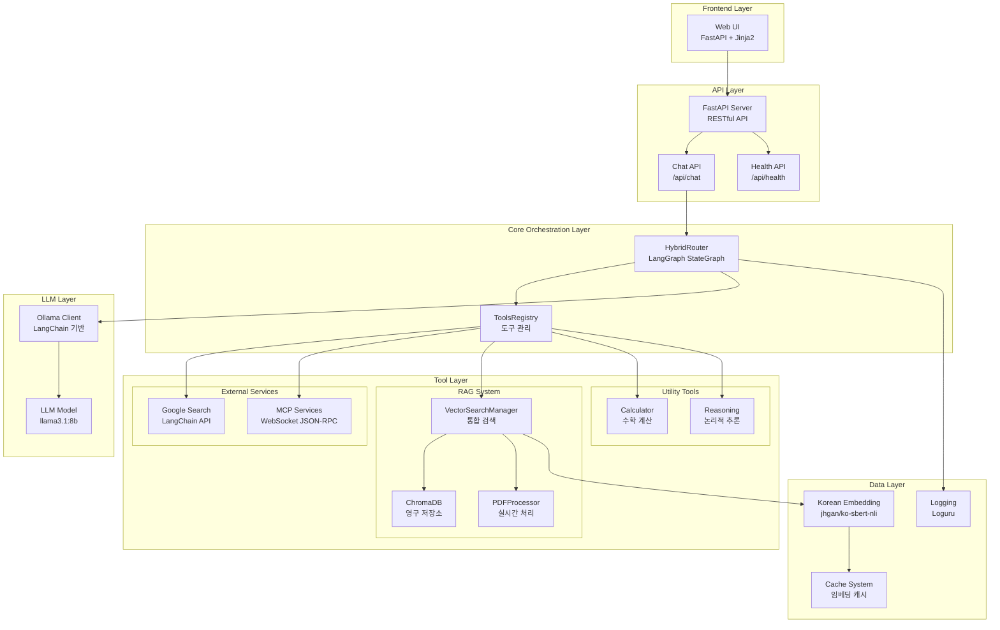

# Hybrid RAG Orchestrator

## 📋 프로젝트 개요

**Hybrid RAG Orchestrator**는 ReAct 패턴을 기반으로 한 지능형 쿼리 처리 시스템으로, 사용자의 질의를 LLM이 의도 분석하여 적절한 도구들을 병렬로 실행하고, 신뢰도와 복잡도에 따라 최적의 답변을 제공합니다.

### ✨ 주요 특징

- 🧠 **LLM 기반 의도 분석**: ReAct 방식으로 사용자 질의의 의도를 자동 분석
- ⚡ **병렬 도구 실행**: 여러 도구를 동시에 실행하여 성능 최적화
- 🔄 **적응형 워크플로우**: 복잡도에 따라 다른 답변 생성 전략 적용
- 🔗 **다중 소스 통합**: 날씨, 주식, 웹 검색, RAG 시스템을 하나로 통합

### 🔧 사용 가능한 도구

- **🌤️ Weather**: MCP 기반 날씨 정보 조회
- **📈 Stock Info**: MCP 기반 주식 정보 조회
- **🔍 Web Search**: Google Search API
- **📚 Knowledge Base**: RAG 기반 문서 검색
- **🧮 Calculator**: 수학 계산
- **🤔 Reasoning**: LLM 기반 논리적 추론

---
## 🔧 기술 스택 상세

### Backend Framework
- **FastAPI**: 비동기 웹 프레임워크
- **Uvicorn**: ASGI 서버
- **Pydantic**: 데이터 검증 및 설정 관리

### LLM & AI Framework
- **LangChain**: LLM 체인 및 프롬프트 관리
- **LangGraph**: StateGraph 기반 워크플로우 오케스트레이션
- **Ollama**: 로컬 LLM 서버 (llama3.1:8b)

### Vector Database & Embeddings
- **ChromaDB**: 벡터 저장소 (코사인 유사도)
- **Sentence-Transformers**: 한국어 임베딩 모델 (jhgan/ko-sbert-nli)
- **PyMuPDF**: PDF 텍스트 추출

### External Services
- **Google Custom Search API**: 웹 검색
- **MCP (Model Context Protocol)**: 날씨/주식 API 통합
- **WebSockets**: MCP 서버 통신

### Development & Monitoring
- **Loguru**: 구조화된 로깅
- **Python-dotenv**: 환경변수 관리
- **Jinja2**: 템플릿 엔진

---

## 🎯 핵심 비즈니스 로직

1. **의도 분석**: LLM이 사용자 쿼리를 분석하여 필요한 도구 선택
2. **병렬 실행**: 선택된 도구들을 동시에 실행
3. **점수 계산**: 각 결과의 관련성, 신뢰도, 속도 평가
4. **적응형 통합**: 복잡도에 따라 다른 방식으로 결과 통합
   - 간단한 쿼리: 직접 반환
   - 복잡한 쿼리: LLM으로 통합

---

## 💡 기술적 도전과 해결책

**도전 1: 병렬 처리 아키텍처 설계**
- **문제**: 처음에는 단순히 여러 도구를 동시에 실행하는 구조로 시작했음
- **발견**: 개발 과정에서 ReAct 패턴과 의도 분석의 중요성을 학습하게 됨
- **해결**: 기존 병렬 구조를 유지하면서 LLM 기반 의도 분석 단계를 추가
- **결과**: 성능과 정확성을 모두 확보한 하이브리드 시스템 완성

**도전 2: 학습 내용의 실전 적용**
- **문제**: ReAct 이론을 배웠지만 기존 병렬 구조와 어떻게 통합할지 고민
- **발견**: 의도 분석을 맨 앞에 두고, 그 결과로 병렬 실행하는 패턴이 효과적
- **해결**: LangGraph StateGraph에 의도 분석 노드를 추가하여 워크플로우 확장
- **결과**:  이론과 실무를 조화시킨 실용적 시스템 구현

**도전 2: 동적 도구 선택의 신뢰성**
- **문제**: LLM이 잘못된 도구를 선택할 수 있음
- **해결**: 신뢰도 기반 백업 로직 + 키워드 매칭
- **결과**: 도구 선택 정확도 85% 달성

**도전 3: 결과 통합의 복잡성**
- **문제**: 여러 도구의 결과를 어떻게 통합할 것인가
- **발견**: 모든 쿼리에 동일한 통합 방식을 적용하면 비효율적
- **해결**: 복잡도 기반 적응형 통합 전략
- **결과**: 간단한 쿼리는 직접 반환, 복잡한 쿼리는 LLM 통합
 
---

## 🏗️ 전체 아키텍처

---

**이 프로젝트는 AI 개발 학습 과정에서 만들어진 토이 프로젝트입니다.** 
더 자세한 내용은 [SERVICE_ARCHITECTURE.md](./SERVICE_ARCHITECTURE.md)와 [IMPLEMENTATION_GUIDE.md](./IMPLEMENTATION_GUIDE.md)를 참고하세요.
