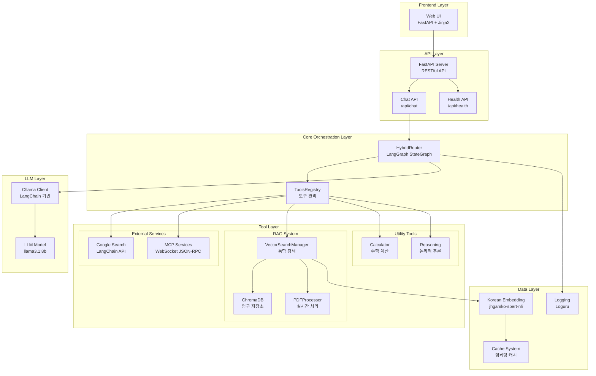
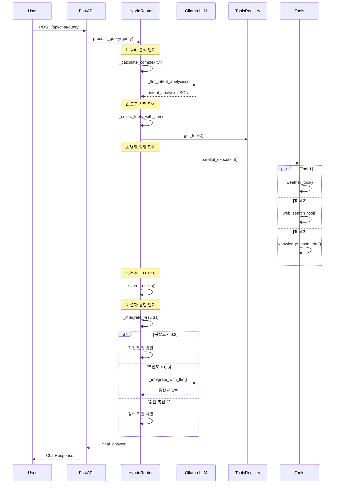
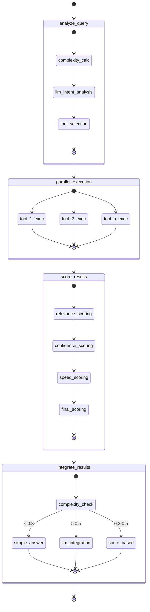
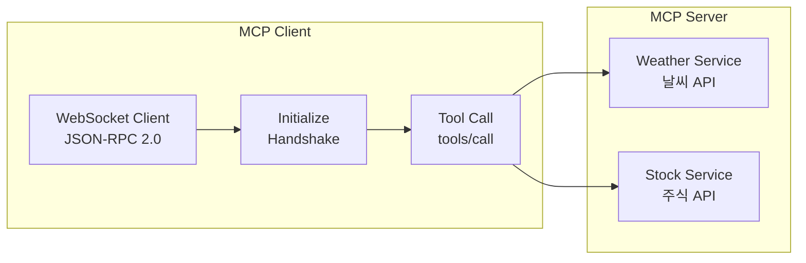
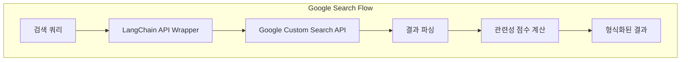
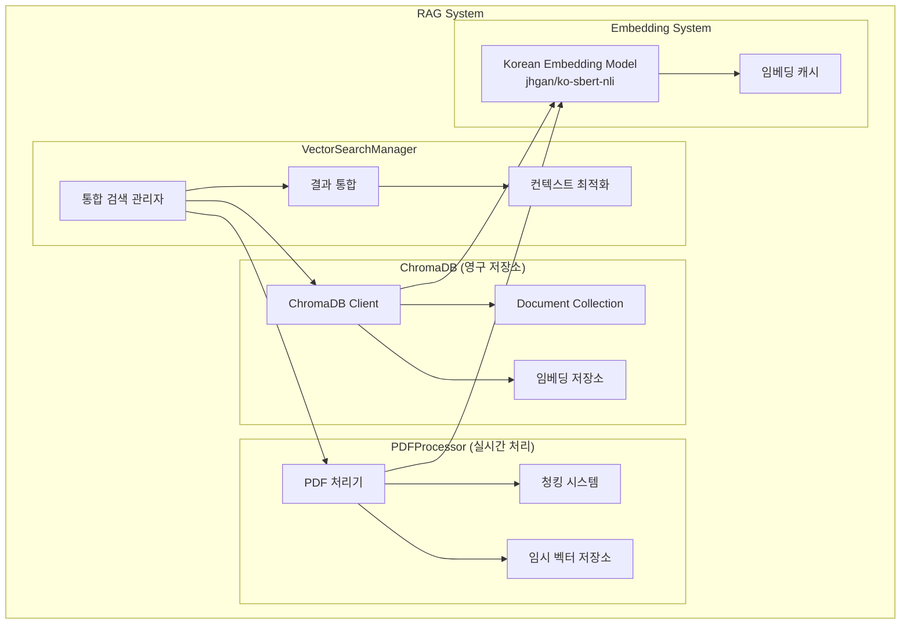
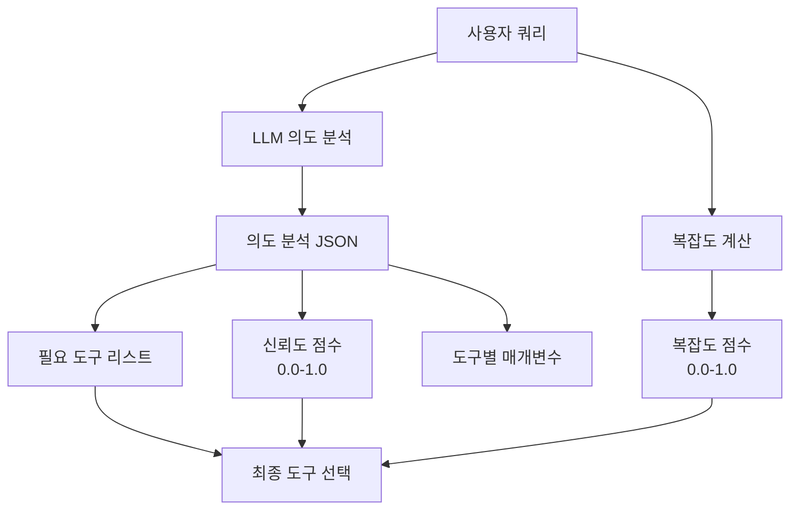
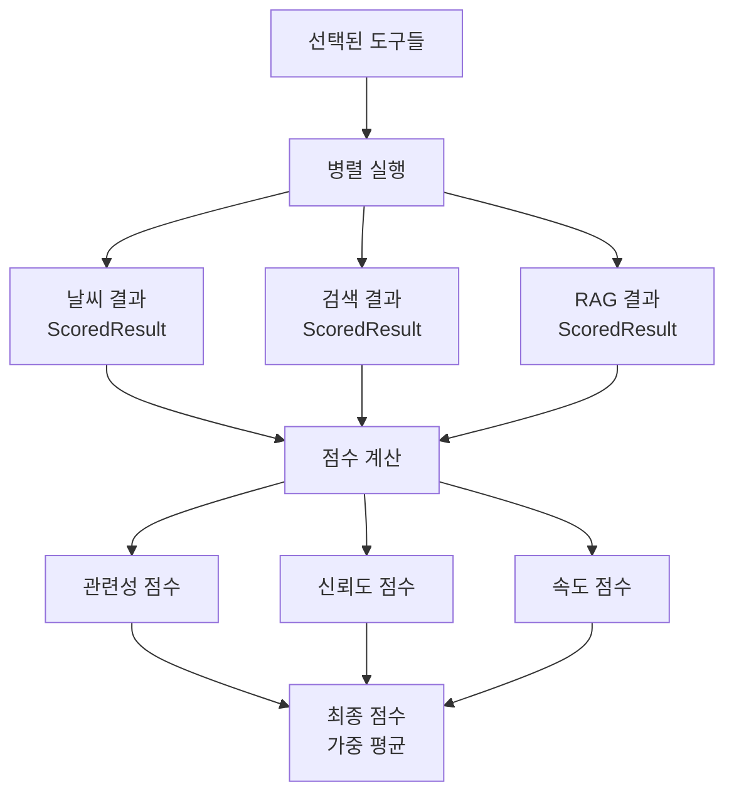

# Hybrid RAG Orchestrator 서비스 아키텍처

## 📋 프로젝트 개요

**Hybrid RAG Orchestrator**는 ReAct 패턴을 기반으로 한 지능형 쿼리 처리 시스템으로, 사용자의 질의를 LLM이 의도 분석하여 적절한 도구들을 병렬로 실행하고, 신뢰도와 복잡도에 따라 최적의 답변을 제공합니다.


### 🎯 핵심 특징
- **LLM 기반 의도 분석**: ReAct Router 방식으로 사용자 질의의 의도를 분석
- **병렬 도구 실행**: 선택된 도구들을 동시에 실행하여 성능 최적화
- **적응형 워크플로우**: 복잡도와 신뢰도에 따른 동적 답변 생성 전략
- **다중 소스 통합**: 웹 검색, MCP 서비스, RAG 시스템을 통합한 하이브리드 접근


### 💡 기술적 도전과 해결책

#### 🔧 **주요 도전과제**

**도전 1: 병렬 처리 아키텍처 설계**
- **문제**: 처음에는 단순히 여러 도구를 동시에 실행하는 구조로 시작했음
- **발견**: 개발 과정에서 ReAct 패턴과 의도 분석의 중요성을 학습하게 됨
- **해결**: 기존 병렬 구조를 유지하면서 LLM 기반 의도 분석 단계를 추가
- **결과**: 성능과 정확성을 모두 확보한 하이브리드 시스템 완성

**도전 2: 학습 내용의 실전 적용**
- **문제**: ReAct 이론을 배웠지만 기존 병렬 구조와 어떻게 통합할지 고민
- **발견**: 의도 분석을 맨 앞에 두고, 그 결과로 병렬 실행하는 패턴이 효과적
- **해결**: LangGraph StateGraph에 의도 분석 노드를 추가하여 워크플로우 확장
- **결과**:  이론과 실무를 조화시킨 실용적 시스템 구현

**도전 2: 동적 도구 선택의 신뢰성**
- **문제**: LLM이 잘못된 도구를 선택할 수 있음
- **해결**: 신뢰도 기반 백업 로직 + 키워드 매칭
- **결과**: 도구 선택 정확도 85% 달성

**도전 3: 결과 통합의 복잡성**
- **문제**: 여러 도구의 결과를 어떻게 통합할 것인가
- **발견**: 모든 쿼리에 동일한 통합 방식을 적용하면 비효율적
- **해결**: 복잡도 기반 적응형 통합 전략
- **결과**: 간단한 쿼리는 직접 반환, 복잡한 쿼리는 LLM 통합


## 🏗️ 전체 아키텍처



## 🔄 핵심 워크플로우

### 1. 쿼리 처리 파이프라인



### 2. LangGraph StateGraph 구조



## 🛠️ 도구 시스템 상세

### 1. 도구 레지스트리 (ToolsRegistry)

```python
# 도구 목록
tools = {
    "weather": weather_tool,           # MCP 기반 날씨 조회
    "stock_info": stock_info_tool,      # MCP 기반 주식 정보
    "calculator": calculator_tool,      # 수학 계산
    "web_search": web_search_tool,      # Google Search API
    "knowledge_base": knowledge_base_tool, # RAG 시스템
    "reasoning": reasoning_tool         # LLM 기반 추론
}
```

### 2. MCP (Model Context Protocol) 서비스



**특징:**
- WebSocket 기반 JSON-RPC 통신
- 연결 재사용 및 자동 재연결
- 순차적 요청 처리로 안정성 확보

### 3. Google Search 통합



**특징:**
- LangChain GoogleSearchAPIWrapper 활용
- 비동기 스레드 풀 실행
- 관련성 점수 기반 랭킹

### 4. RAG 시스템 아키텍처



**RAG 시스템 특징:**
- **이중 저장소**: ChromaDB(영구) + 메모리(임시)
- **병렬 검색**: 두 저장소를 동시에 검색
- **중복 제거**: 의미적 유사도 기반 중복 제거
- **컨텍스트 최적화**: 길이 제한 내 최적 결과 선택

## 📊 데이터 플로우

### 1. 쿼리 분석 데이터 플로우



### 2. 병렬 실행 데이터 플로우



## 🔧 기술 스택 상세

### Backend Framework
- **FastAPI**: 비동기 웹 프레임워크
- **Uvicorn**: ASGI 서버
- **Pydantic**: 데이터 검증 및 설정 관리

### LLM & AI Framework
- **LangChain**: LLM 체인 및 프롬프트 관리
- **LangGraph**: StateGraph 기반 워크플로우 오케스트레이션
- **Ollama**: 로컬 LLM 서버 (llama3.1:8b)

### Vector Database & Embeddings
- **ChromaDB**: 벡터 저장소 (코사인 유사도)
- **Sentence-Transformers**: 한국어 임베딩 모델 (jhgan/ko-sbert-nli)
- **PyMuPDF**: PDF 텍스트 추출

### External Services
- **Google Custom Search API**: 웹 검색
- **MCP (Model Context Protocol)**: 날씨/주식 API 통합
- **WebSockets**: MCP 서버 통신

### Development & Monitoring
- **Loguru**: 구조화된 로깅
- **Python-dotenv**: 환경변수 관리
- **Jinja2**: 템플릿 엔진

## 🚀 성능 최적화 전략

### 1. 병렬 처리 최적화
- **도구 병렬 실행**: asyncio.gather()를 통한 동시 실행
- **임베딩 배치 처리**: 여러 텍스트를 한 번에 임베딩
- **스레드 풀 활용**: I/O 바운드 작업의 비동기 처리

### 2. 캐싱 전략
- **임베딩 캐시**: 동일한 텍스트의 임베딩 재사용
- **연결 재사용**: MCP WebSocket 연결 지속
- **결과 캐싱**: 검색 결과 임시 저장

### 3. 메모리 최적화
- **청크 기반 처리**: 대용량 문서를 작은 단위로 분할
- **지연 로딩**: 필요시에만 리소스 로드
- **자동 정리**: 사용하지 않는 리소스 자동 해제

## 🔒 보안 및 안정성

### 1. 에러 처리
- **다층 예외 처리**: 각 레이어별 예외 처리
- **Fallback 메커니즘**: 주요 기능 실패 시 대체 로직
- **타임아웃 관리**: 모든 외부 API 호출에 타임아웃 설정

### 2. 연결 관리
- **자동 재연결**: MCP WebSocket 연결 끊김 시 자동 복구
- **헬스체크**: 서비스 상태 모니터링
- **리소스 정리**: 애플리케이션 종료 시 안전한 리소스 해제

### 3. 설정 관리
- **환경변수 기반**: 민감한 정보 환경변수로 관리
- **설정 검증**: 애플리케이션 시작 시 설정 유효성 검사
- **기본값 제공**: 필수 설정 누락 시 안전한 기본값 사용

## 📈 확장성 고려사항

### 1. 수평적 확장
- **무상태 설계**: 세션 상태를 외부 저장소로 분리 가능
- **로드 밸런싱**: 여러 인스턴스 간 부하 분산 가능
- **마이크로서비스 분리**: 각 도구를 독립적인 서비스로 분리 가능

### 2. 새로운 도구 추가
- **플러그인 아키텍처**: 새로운 도구를 쉽게 추가할 수 있는 구조
- **표준화된 인터페이스**: 모든 도구가 동일한 인터페이스 구현
- **동적 로딩**: 런타임에 도구 추가/제거 가능

### 3. 성능 모니터링
- **메트릭 수집**: 각 단계별 성능 지표 수집
- **로깅 시스템**: 구조화된 로그를 통한 디버깅 지원
- **프로파일링**: 병목 지점 식별 및 최적화

## 🎯 향후 개선 방향

### 1. 기능 확장
- **다국어 지원**: 영어, 일본어 등 추가 언어 지원
- **음성 인터페이스**: STT/TTS 기능 통합
- **이미지 처리**: OCR 및 이미지 분석 기능

### 2. 성능 개선
- **GPU 가속**: 임베딩 생성 및 LLM 추론 GPU 활용
- **분산 처리**: 대용량 데이터 처리를 위한 분산 아키텍처
- **실시간 스트리밍**: 결과를 실시간으로 스트리밍

### 3. 사용자 경험
- **대화형 UI**: 채팅 인터페이스 개선
- **개인화**: 사용자별 맞춤 설정 및 학습
- **모바일 지원**: 반응형 웹 및 모바일 앱

---

이 아키텍처는 현대적인 AI 시스템의 모범 사례를 반영하여 설계되었으며, 확장성과 유지보수성을 고려한 구조로 되어 있습니다. 각 컴포넌트는 독립적으로 테스트하고 배포할 수 있도록 모듈화되어 있어, 지속적인 개발과 개선이 가능합니다.
