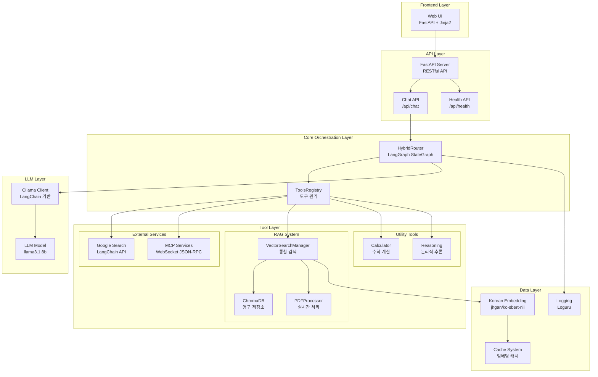
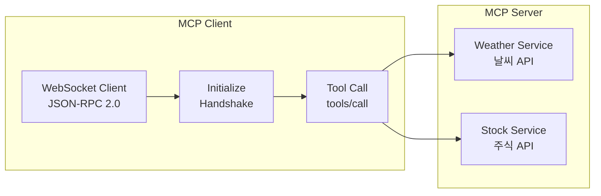
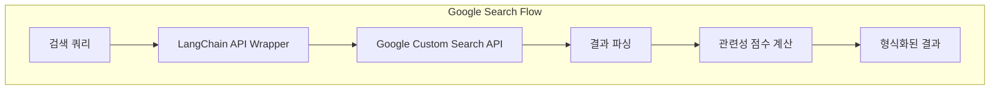
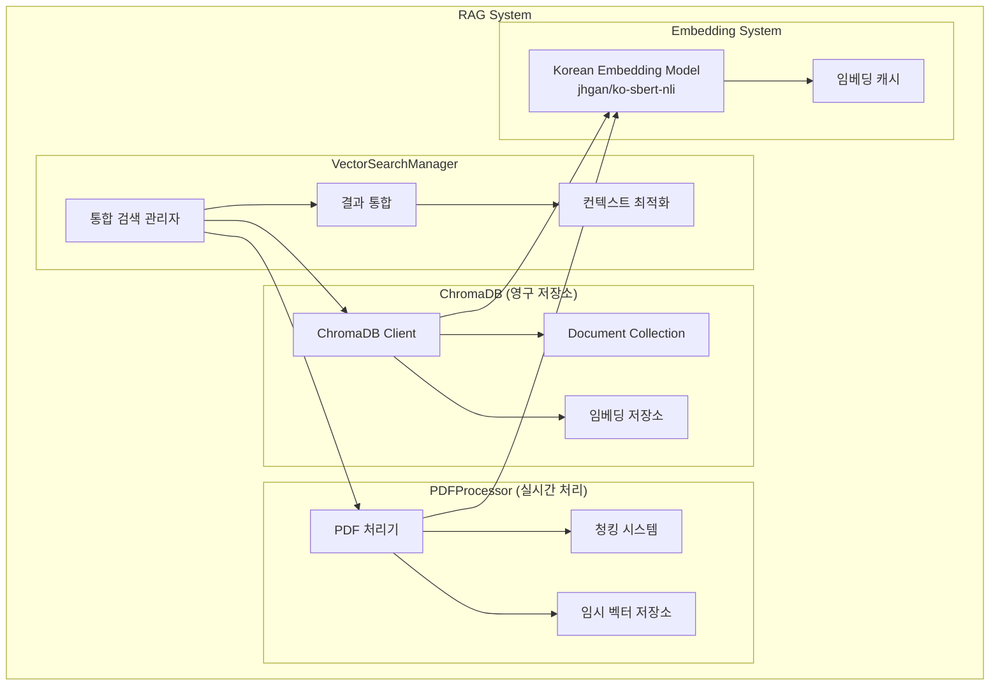

# Hybrid RAG Orchestrator 서비스 아키텍처

## 🏗️ 전체 아키텍처




## 🛠️ 도구 시스템 상세

### 1. 도구 레지스트리 (ToolsRegistry)

```python
# 도구 목록
tools = {
    "weather": weather_tool,           # MCP 기반 날씨 조회
    "stock_info": stock_info_tool,      # MCP 기반 주식 정보
    "calculator": calculator_tool,      # 수학 계산
    "web_search": web_search_tool,      # Google Search API
    "knowledge_base": knowledge_base_tool, # RAG 시스템
    "reasoning": reasoning_tool         # LLM 기반 추론
}
```

### 2. MCP (Model Context Protocol) 서비스



**특징:**
- WebSocket 기반 JSON-RPC 통신
- 연결 재사용 및 자동 재연결
- 순차적 요청 처리로 안정성 확보

### 3. Google Search 통합



**특징:**
- LangChain GoogleSearchAPIWrapper 활용
- 비동기 스레드 풀 실행
- 관련성 점수 기반 랭킹

### 4. RAG 시스템 아키텍처



**RAG 시스템 특징:**
- **이중 저장소**: ChromaDB(영구) + 메모리(임시)
- **병렬 검색**: 두 저장소를 동시에 검색
- **중복 제거**: 의미적 유사도 기반 중복 제거
- **컨텍스트 최적화**: 길이 제한 내 최적 결과 선택


